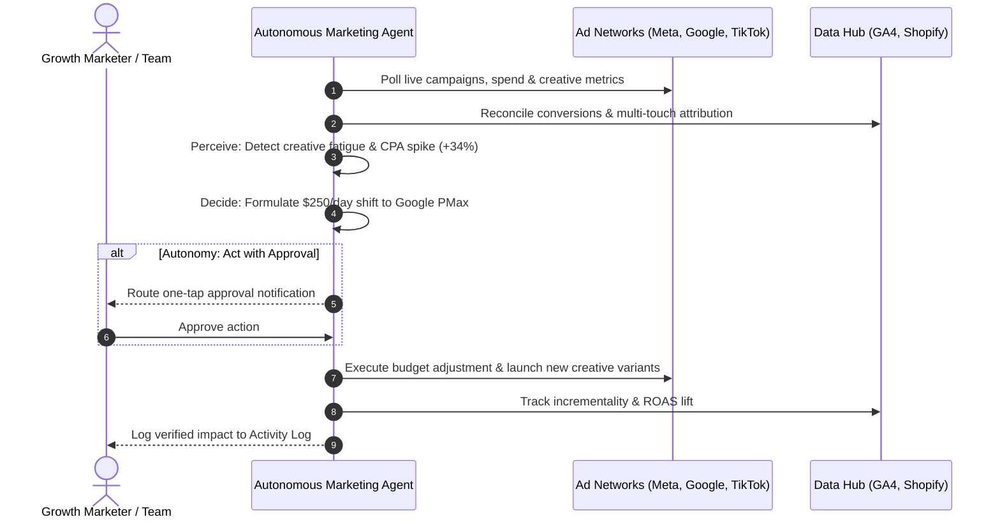

# genpark-autonomous-marketing-campaign-optimizer-skill

[](https://www.python.org/)
[](https://opensource.org/licenses/MIT)
[](https://modelcontextprotocol.io/)
[](https://genpark.ai)

> **GenPark AI Agent Skill** — Autonomous AI Marketing Campaign Optimizer & Closed-Loop Cross-Channel Orchestration Agent.

An always-on autonomous growth engine that connects directly to modern performance marketing stacks (Meta Ads, Google Ads, TikTok Ads, GA4, and Shopify) to move beyond passive analytics dashboards toward proactive, machine-speed execution.

---

## ⚡ Key Capabilities

- **360° Account Audits**: Unifies 200+ marketing signals across Meta, Google, and TikTok to identify CPA spikes, underperforming keywords, and creative fatigue in real time.
- **Graduated Autonomy**: Choose your operational comfort level from **Observe** (read-only diagnostics) to **Recommend** (advisory), **Act with Approval** (gated one-tap approvals via Slack/Webhooks), and **Full Autonomy** (hands-free closed-loop optimization).
- **Cross-Channel Budget Rebalancing**: Mathematically reallocates daily budgets toward top-performing cohorts based on real-time multi-touch GA4 attribution.
- **Generative Creative Engine**: Rapidly spins up high-converting ad angles, copy hooks, and visual concepts to combat creative exhaustion before CPA spikes.
- **Model Context Protocol (MCP)**: Seamless integration into Claude Desktop, Cursor, and multi-agent systems via native stdio MCP tools.

---

## 🔄 Closed-Loop Architecture



---

## 🛠️ Graduated Autonomy Tiers

| Level | Mode | Behavior |
| :--- | :--- | :--- |
| **Level 1** | `observe` | Continuous account monitoring and diagnostics; logs anomalies without modifying campaigns. |
| **Level 2** | `recommend` | Synthesizes growth opportunities and presents prioritized recommendations to human operators. |
| **Level 3** | `act_with_approval` *(Default)* | Prepares and stages bid/budget adjustments, routing high-impact decisions to one-tap approval. |
| **Level 4** | `full_autonomy` | Fully autonomous 24/7 campaign management within preset safety guardrails. |

---

## 🚀 Quick Start

### 1. Installation

```bash
git clone https://github.com/alphaparkinc/genpark-autonomous-marketing-campaign-optimizer-skill.git
cd genpark-autonomous-marketing-campaign-optimizer-skill
```

### 2. Run Example Workflow

```bash
python example_usage.py
```

### 3. Basic Python Usage

```python
from marketing_optimizer_client import MarketingOptimizerClient, MarketingOptimizerConfig, AutonomyLevel

# Configure client with one-tap approval safeguards
client = MarketingOptimizerClient(MarketingOptimizerConfig(
    autonomy_level=AutonomyLevel.ACT_WITH_APPROVAL,
    max_budget_shift_pct=20.0
))

# 1. Audit connected ad channels
audit = client.audit_accounts(["meta", "google", "tiktok", "ga4"])
print(f"Health Score: {audit['overall_health_score']}/100")

# 2. Optimize budgets
decision = client.optimize_budgets()
print(f"Proposed Shift: {decision['reallocated_amount_daily_usd']}/day (Status: {decision['status']})")

# 3. Generate fresh ad creative variants
creatives = client.generate_creative_variants(
    product_name="UltraShield Pro",
    value_props=["Military grade durability", "Sleek magnetic snap-on"],
    target_audience="Tech enthusiasts aged 25-40"
)
```

---

## 🔌 Model Context Protocol (MCP) Integration

To use with **Claude Desktop** or **Cursor**, add the following entry to your `claude_desktop_config.json`:

```json
{
  "mcpServers": {
    "marketing-optimizer-agent": {
      "command": "python",
      "args": [
        "/path/to/genpark-autonomous-marketing-campaign-optimizer-skill/mcp_server.py"
      ]
    }
  }
}
```

### Supported MCP Tools

- `marketing_audit_accounts`: Runs multi-channel diagnostics across connected ad accounts.
- `marketing_optimize_budgets`: Evaluates marginal ROAS and triggers budget shifts.
- `marketing_approve_action`: Approves and executes a gated marketing decision.
- `marketing_generate_creatives`: Generates targeted copy angles and hooks.
- `marketing_get_activity_log`: Inspects complete perceive-decide-act audit trails.

---

## 📄 License

MIT License. See [LICENSE](LICENSE) for details.
